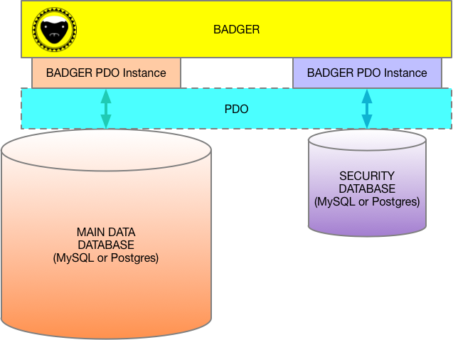

[]: # \page BADGER BADGER

BADGER
======
Part of the Rift Valley Platform
--------------------------------

INTRODUCTION
============

***[Hardened Baseline Database Component](https://en.wikipedia.org/wiki/The_Crazy_Nastyass_Honey_Badger#Honey_Badger_Don't_Care)***

This is the baseline database system for the secure database toolbox.
It's a low-level database storage system that implements a generic KVP database and a separate security database.
BADGER will work equally well for both [MySQL](https://www.mysql.com) and [PostgreSQL](https://www.postgresql.org) databases.
BADGER has two completely separate databases: One is the main "Data Bucket" database, and the other is a security database. They can be separate hosts and even database types (MySQL or Postgres).
BADGER has an ultra-simple schema. Each database has only one table.
Security is via a simple token arrangement.
Each database table row (either database) has a read token and a write token. It has only one of each. If the read or write operation is attempted by a user without the token, then the record is automatically excluded from the results at the SQL level. Tokens are IDs for security database nodes. A login node (security database) has its own ID as a token, and can also have a list of IDs that are available to it as well.
BADGER is extremely basic. No relating or data processing is done by BADGER, with one exception: it does have longitude and latitude (in degrees) built into its table schema, for the simple reason that being able to access these at the SQL level greatly improves performance. We  have a built-in [Haversine](https://en.wikipedia.org/wiki/Haversine_formula) search in SQL to act as a "rapid triage" for locations, which are then filtered using the more accurate (and computationally-intense) [Vincenty's Formulae](https://en.wikipedia.org/wiki/Vincenty%27s_formulae). This means that geographic location/radius searches are extremely accurate, and very fast.

LICENSE
=======

© Copyright 2018, [Little Green Viper Software Development LLC](https://littlegreenviper.com).
This code is ENTIRELY proprietary and not to be reused, unless under specific, written license from [Little Green Viper Software Development LLC](https://littlegreenviper.com).

DESCRIPTION
===========

PDO
---

At the lowest level, the system uses [PHP PDO](https://php.net/pdo) to access the data base through [PDO Prepared Statements](https://secure.php.net/manual/en/pdo.prepared-statements.php).
This enhances security by ensuring that all database access is "scrubbed" by PDO, so the risk of [SQL injection attacks](https://www.w3schools.com/sql/sql_injection.asp) is greatly reduced.
PDO also helps the system to be "database agnostic," as PDO has equal support for both [MySQL](https://www.mysql.com) and [PostgreSQL](https://www.postgresql.org). It is designed to scale for large datasets.

TWO INDEPENDENT DATABASES
-------------------------

The most important security structure is that there are two separate databases (not just different tables on a single database), with one containing data, and the other containing logins and security tokens.
Each database is managed by its own PDO instance, so they don't need to be on the same server, or even be the same technology.

SECURITY TOKENS
---------------

Access to read and write data entities is determined by "security tokens." Security tokens are simple integers, each representing an ID in the security database. Database table rows are assigned a read token and a write token.
Logins in the security database are assigned a series of integer tokens in a CSV list, in addition to their own ID. If the login item has the token for reading or writing assigned to a particular row, then that login has permission to read (and maybe write) that row.
Badger is designed to mask rows that don't meet the login security token list at the database query level, so they never even make it into the system.
Tokens are checked after reloading the logged in user, so it is not possible for a logged-in user to escalate their permissions.
The security database has two kinds of rows: logins and security token IDs (Whose entire reason for existence is to hold a security token). Each login is also a security token ID, but has a hashed password and login ID associated.

THERE IS NO GOD BUT GOD
-----------------------

Only one of the logins can be a "God" login; a login that has full permissions to everything. There are no "security levels." All security is done through tokens. The "God" ID is set as an integer ID in the config file, and the password is also stored (as cleartext) in the config file.

CONFIG FILE
-----------

The config file can (and should) be kept out of the HTTP path, making it harder for outside entities to access.
The config file consists of a static class, with "hardcoded" constants. The class exists mainly as a namespace.

KEEPING IT SIMPLE
-----------------

The database schema is incredibly simple. There are no relations at the database level, although the "owner" field of the "data" database could be used as such.
Each database has but one single row, and the data format (the columns) are the same for all rows of that database. Differentiation is done through the "access_class" column, which contains the name of a PHP class that can handle that row. There is also an "access_class_context" column, which contains serialized data, storing a persistent state for the class instance.
Both the "data" database and the "security" database tables have the same basic root structure, and are handled by a common abstract base class.
Hierarchy and organization are meant to be applied outside the database, using classes and instances. The database is really just supposed to be a "locked cabinet."
The first row of each table (ID 1) is a "template" of values to be used when instantiating new table rows.

LONGITUDE AND LATITUDE
----------------------

The one built-in specialization is the inclusion of "longitude" and "latitude" (in degrees) columns in the "data" database table. This is because it is possible to do highly efficient, fast [Haversine](https://en.wikipedia.org/wiki/Haversine_formula) lookups in SQL. We have built these into the system.
Once a Haversine search has been made, the resulting data set is then subjected to the more accurate [Vincenty's Formula](https://en.wikipedia.org/wiki/Vincenty%27s_formulae) in order to "fine tune" the result.
The result of this, is that Badger is an ideal vehicle to keep a database of locations for fast retrieval, based on longitude and latitude, and a radius.

TAGS
----

Each "data" database row has ten "tags." These are 255-character "VARCHAR" fields that can be used for many things. They are indexed for fast search (thus, are limited in length).

PAYLOAD
-------

The "data" database schema also specifies a 4096-character "TEXT" (Postgres) or "LONGBLOB" (MySQL) column, called "payload". This is used to store larger data with a data item. It is not indexed, and can store binary (and encrypted) data, but the data is stored as [Base64](https://en.wikipedia.org/wiki/Base64).

EXTENDING AND SPECIALIZING BADGER
---------------------------------

Badger is a baseline system. It provides a generic interface to a simple database, and is not designed to be used "as is." It should be extended via subclasses of the row classes and the access class.
In order to extend the row classes, you should create a directory (path and name determined by the config class). Put your classes that extend the class in "db/a_co_db_table_base.class.php" there (actually, you should be extending subclasses of this base class). It does not need to be in the HTTP path.
The files containing classes should be named after the class, all lower case, with '.class.php' appended.

